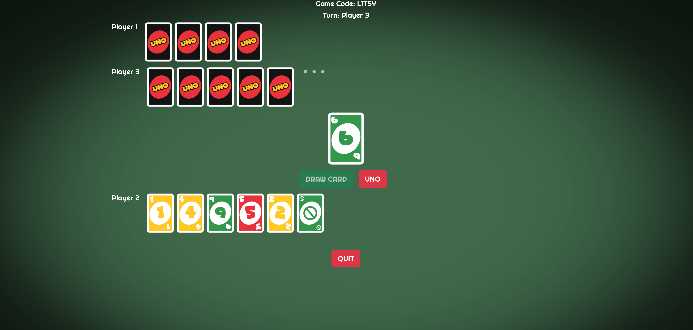

# UnoCard

Live at https://unocards.herokuapp.com/

## What is UnoCard?
UnoCard is a three-player online version of famous UNO card game. 

## ScreenShots





## About
This project was build with React, Express, Node and Socket.io

## Prerequisites
- Node
- NPM
- Express
- Socket.io

## Installation
1. in the root of the project directory, install dependencies and start server
```
npm install
npm start
```
2. in the client folder, install dependencies and start frontend
```
cd client
npm install
npm start
```
## Thanks to
1. https://github.com/mizanxali/uno-online (Mizan Ali, thanks for sharing the code)
2. https://alexder.itch.io/uno-card-game-asset-pack (Alex Der, thanks for card assets)


